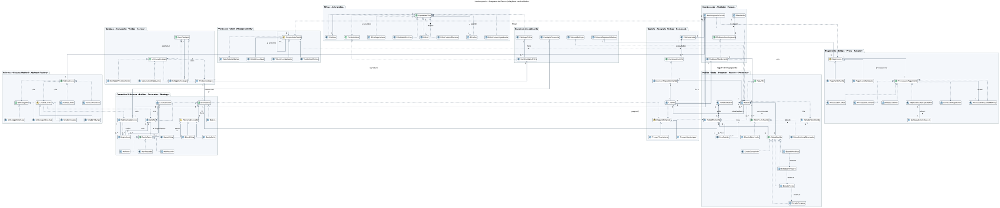
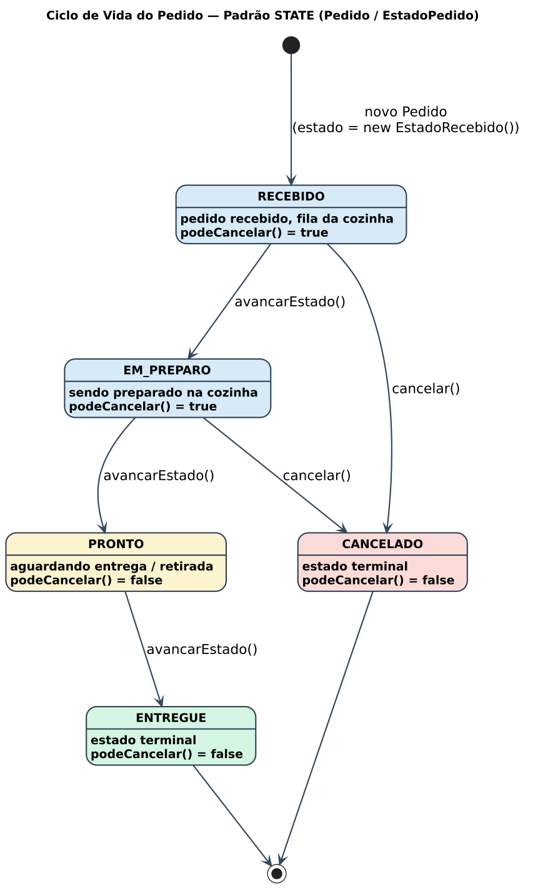

# 🍔 Hamburgueria: os 23 Padrões de Projeto GoF


Sistema de pedidos para uma hamburgueria com **atendimento presencial** e **pedidos online**, desenvolvido como projeto final da disciplina **Arquitetura e Projeto de Software**.

O objetivo do projeto é aplicar **os 23 padrões de projeto do catálogo GoF** (*Gang of Four*) em um domínio realista. Cada padrão resolve um problema concreto do negócio: montar lanches, compor o cardápio, controlar o ciclo de vida do pedido, processar pagamentos, organizar a cozinha e notificar clientes.

> O projeto é Java puro, sem `main`, sem API e sem interface gráfica. O comportamento do sistema é demonstrado e verificado pelos **155 testes unitários**.

---

## 📋 Sumário

- [Visão geral do domínio](#-visão-geral-do-domínio)
- [Padrões implementados](#-padrões-implementados)
- [Diagramas UML](#-diagramas-uml)
- [Estrutura do projeto](#-estrutura-do-projeto)
- [Exemplo de uso](#-exemplo-de-uso)
- [Como executar](#-como-executar)
- [Tecnologias](#-tecnologias)

---

## 🧭 Visão geral do domínio

O sistema está dividido em três módulos:

| Módulo | Responsabilidade |
|---|---|
| **`compartilhado`** | Núcleo comum aos dois canais: lanches, cardápio, pedidos, cozinha, pagamentos, validações e filtros. |
| **`presencial`** | Atendimento no balcão: cardápio físico e atendente que encaminha pedidos à cozinha. |
| **`online`** | Pedidos por aplicativo: catálogo com filtros, pagamento via Pix com limite, cálculo de frete e notificações ao cliente. |

**Fluxo de um pedido:**

1. O cliente escolhe itens no cardápio (presencial) ou no catálogo filtrável (online).
2. O lanche é montado e pode receber adicionais (bacon, queijo, blend extra) e um ponto de carne.
3. O pedido passa por uma cadeia de validações (itens não vazios, valor mínimo, pode ser cancelado).
4. A cozinha recebe o pedido e prepara os itens que exigem preparo. Bebidas são entregues direto.
5. O pedido avança pelos estados **Recebido → Em preparo → Pronto → Entregue** (ou **Cancelado**), notificando cliente e cozinha a cada mudança.
6. O pagamento é processado por Pix, cartão, dinheiro ou um gateway externo legado, à vista ou parcelado.

---

## 🧩 Padrões implementados

### Criacionais (5/5)

| Padrão | Onde | Para que serve no sistema |
|---|---|---|
| **Abstract Factory** | `FabricaCanal`, `FabricaPresencial`, `FabricaOnline` | Cria a família de objetos de cada canal: embalagem (`EmbalagemBandeja` no presencial, `EmbalagemDelivery` no online) e os criadores de lanche. |
| **Factory Method** | `CriadorLanche`, `CriadorXBurger`, `CriadorXSalada` | Cada criador concreto decide qual lanche produzir, enquanto `produzir()` mantém o fluxo comum. |
| **Builder** | `LancheBuilder` | Monta lanches personalizados passo a passo (`comNome`, `comPrecoBase`, `adicionarIngrediente`, `comPonto`, `comoVegetariano`). |
| **Prototype** | `Lanche.clonar()` | Cria cópias de um lanche já configurado, sem compartilhar a lista de ingredientes. |
| **Singleton** | `Cozinha.obterInstancia()` | Garante uma única cozinha com uma única fila de pedidos. |

### Estruturais (7/7)

| Padrão | Onde | Para que serve no sistema |
|---|---|---|
| **Adapter** | `AdaptadorGatewayExterno` ↔ `GatewayExternoLegado` | Integra um gateway de pagamento legado, com interface incompatível, à interface `ProcessadorPagamento`. |
| **Bridge** | `Pagamento` (`PagamentoAVista`, `PagamentoParcelado`) × `ProcessadorPagamento` (`ProcessadorPix`, `ProcessadorCartao`, `ProcessadorDinheiro`) | Separa a **forma** de pagamento do **meio** de processamento, para que os dois lados variem de forma independente. |
| **Composite** | `ItemCardapio`, `CategoriaCardapio`, `ProdutoCardapio` | Representa o cardápio como uma árvore de categorias e produtos tratados de forma uniforme. |
| **Decorator** | `AdicionalDecorator`, `BaconExtra`, `QueijoExtra`, `BlendExtra` | Acrescenta adicionais ao lanche em tempo de execução, somando descrição e preço. |
| **Facade** | `HamburgueriaFacade` | Ponto de entrada simplificado: abrir, validar, preparar, desfazer preparo e pagar um pedido. |
| **Flyweight** | `FabricaIngredientes`, `Ingrediente` | Compartilha instâncias de ingredientes iguais entre todos os lanches, em vez de criar cópias. |
| **Proxy** | `ProcessadorPagamentoProxy` | Controla o acesso ao processador real e recusa pagamentos acima de um limite (R$ 500,00 por padrão no online). |

### Comportamentais (11/11)

| Padrão | Onde | Para que serve no sistema |
|---|---|---|
| **Chain of Responsibility** | `ManipuladorPedido`, `ValidaItensNaoVazio`, `ValidaValorMinimo`, `ValidaCancelavel` | Encadeia validações do pedido. Cada elo valida e repassa ao próximo (`encadear`). |
| **Command** | `ComandoCozinha`, `AvancarPreparoComando`, `FilaComandos` | Encapsula ações da cozinha como objetos, permitindo executar e **desfazer** o avanço do preparo. |
| **Interpreter** | `ExpressaoFiltro`, `FiltroE`, `FiltroOu`, `FiltroNao`, `FiltroVegetariano`, `FiltroPrecoMaximo`, `FiltroCaloriasMaximas`, `FiltroContemIngrediente` | Monta expressões de filtro combináveis para buscar itens no catálogo online. |
| **Iterator** | `IteradorItensPedido`, `Pedido implements Iterable` | Percorre os itens de um pedido sem expor a coleção interna. |
| **Mediator** | `MediadorHamburgueria`, `MediadorAtendimento` | Centraliza a comunicação entre atendente, cozinha e observadores, que não se conhecem diretamente. |
| **Memento** | `PedidoMemento`, `HistoricoPedido` | Salva e restaura o estado de um pedido (estado e itens), permitindo desfazer alterações. |
| **Observer** | `Assunto`, `ObservadorPedido`, `ClienteObservador`, `PainelCozinhaObservador` | Notifica cliente e painel da cozinha a cada mudança de estado do pedido. |
| **State** | `EstadoPedido`, `EstadoRecebido`, `EstadoEmPreparo`, `EstadoPronto`, `EstadoEntregue`, `EstadoCancelado` | Cada estado define a próxima transição e se o pedido ainda pode ser cancelado. |
| **Strategy** | `PontoCarne`, `MalPassado`, `AoPonto`, `BemPassado` | Ponto da carne intercambiável em cada lanche. |
| **Template Method** | `PreparoTemplate`, `PreparoHamburguer`, `PreparoVegetariano` | Define o roteiro fixo de preparo (separar → montar → cozinhar → finalizar). As subclasses personalizam as etapas. |
| **Visitor** | `VisitanteCardapio`, `CalculadoraPrecoVisitor`, `ContadorProdutosVisitor` | Executa operações sobre a árvore do cardápio (somar preços, contar produtos) sem alterar as classes dela. |

---

## 📐 Diagramas UML

### Diagrama de Classes



> Versão em PDF: [`DiagramaClasse.pdf`](DiagramaClasse.pdf)

### Diagrama de Estados do Pedido



> Versão em PDF: [`DiagramaEstado.pdf`](DiagramaEstado.pdf)

---

## 📁 Estrutura do projeto

```
src/
├── main/java/com/hamburgueria/
│   ├── compartilhado/
│   │   ├── cardapio/          # Composite
│   │   │   └── visitor/       # Visitor
│   │   ├── cozinha/           # Singleton
│   │   │   ├── comando/       # Command
│   │   │   └── preparo/       # Template Method
│   │   ├── facade/            # Facade
│   │   ├── fabrica/
│   │   │   ├── canal/         # Abstract Factory
│   │   │   └── lanche/        # Factory Method
│   │   ├── filtro/            # Interpreter
│   │   ├── lanche/            # Builder, Prototype, Flyweight
│   │   │   ├── adicional/     # Decorator
│   │   │   └── ponto/         # Strategy
│   │   ├── mediator/          # Mediator
│   │   ├── notificacao/       # Observer (interfaces)
│   │   ├── pagamento/         # Bridge, Adapter, Proxy
│   │   ├── pedido/            # Iterator
│   │   │   ├── estado/        # State
│   │   │   └── memento/       # Memento
│   │   └── validacao/         # Chain of Responsibility
│   ├── online/
│   │   ├── entrega/           # Cálculo de frete
│   │   ├── notificacao/       # Observers concretos (cliente e cozinha)
│   │   └── pagamento/         # Pagamento online (Bridge + Proxy)
│   └── presencial/            # Cardápio físico e atendente
└── test/java/com/hamburgueria/  # 155 testes unitários (JUnit 4)
```

---

## 💡 Exemplo de uso

```java
// Facade + Abstract Factory + Singleton + Flyweight
HamburgueriaFacade hamburgueria = new HamburgueriaFacade(
        new FabricaPresencial(),
        new FabricaIngredientes(),
        Cozinha.obterInstancia());

Pedido pedido = hamburgueria.abrirPedido("PED-001");

// Observer: o cliente é avisado a cada mudança de estado
pedido.registrar(new ClienteObservador("Maria"));

// Chain of Responsibility: validações encadeadas
ManipuladorPedido cadeia = new ValidaItensNaoVazio();
cadeia.encadear(new ValidaValorMinimo(new BigDecimal("10.00")));
ResultadoValidacao validacao = hamburgueria.validar(pedido, cadeia);

// Command + State: avança o preparo e permite desfazer
hamburgueria.avancarPreparo(pedido);      // RECEBIDO -> EM_PREPARO
hamburgueria.desfazerUltimoPreparo();     // volta para RECEBIDO

// Bridge + Proxy: Pix à vista, com limite de valor
Pagamento pagamento = new PagamentoAVista(
        new ProcessadorPagamentoProxy(new ProcessadorPix(), new BigDecimal("500.00")));
ResultadoPagamento resultado = hamburgueria.pagar(pedido, pagamento);
```

```java
// Factory Method + Decorator: X-Burger com bacon e queijo extra
Lanche xBurger = new FabricaPresencial().criadorXBurger().produzir(new FabricaIngredientes());
Comestivel lanche = new QueijoExtra(new BaconExtra(xBurger));
lanche.descricao(); // "X-Burger, pao, blend, queijo + bacon + fatia de queijo"
lanche.preco();     // 36.00 (preço base + adicionais)

// Interpreter: itens vegetarianos de até R$ 30 OU com menos de 500 kcal
ExpressaoFiltro filtro = new FiltroE(
        new FiltroVegetariano(),
        new FiltroOu(new FiltroPrecoMaximo(new BigDecimal("30.00")),
                     new FiltroCaloriasMaximas(500)));
List<ItemCardapioOnline> resultado = catalogo.filtrar(filtro);
```

---

## ▶️ Como executar

**Pré-requisitos:** JDK 17+ e Maven 3.8+

```bash
# Clonar o repositório
git clone https://github.com/<seu-usuario>/Hamburgueria.git
cd Hamburgueria

# Compilar e rodar os testes
mvn test

# Rodar uma classe de teste específica
mvn test -Dtest=PedidoTest
```

Depois de `mvn test`, o relatório de cobertura do **JaCoCo** fica em:

```
target/site/jacoco/index.html
```

---

## 🛠️ Tecnologias

- **Java 17**
- **Maven** (build e dependências)
- **JUnit 4.13**: 155 testes unitários
- **JaCoCo**: relatório de cobertura de testes
- **UML**: diagramas de classes e de estados

---

## 🎓 Contexto acadêmico

Projeto final da disciplina **Arquitetura e Projeto de Software**.
